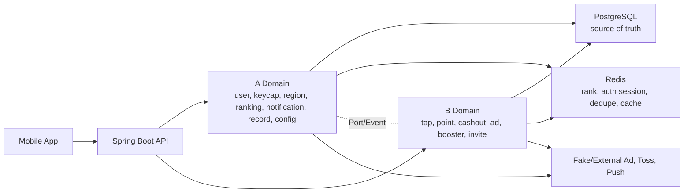

# 꾹머니 아키텍처

## 전체 구조

꾹머니는 모듈형 모놀리스로 시작한다. A/B 담당 도메인을 패키지와 Application Port로 분리하고, 서로의 Entity와 Repository를 직접 참조하지 않는다.

## A/B 경계

| 구분 | 도메인 |
|---|---|
| A | 회원/인증, 키캡/상자, 지역/랭킹, 알림, 기록, 설정/법적 문서 |
| B | 탭 검증, 포인트, 출금, 광고/부스터, 친구 초대 |

경계 원칙:

- A는 B 테이블을 직접 조인하지 않는다.
- B는 A Entity/Repository를 직접 사용하지 않는다.
- 사용자 식별자는 `app_user.public_id`를 외부 계약에 사용하고 DB 내부 id는 노출하지 않는다.
- B 이벤트는 A 기록 projection으로 수신한다.
- 광고 완료 자체가 상자를 지급하지 않는다. A는 완료된 `ad_view`를 확인하고 사용자의 기존 상자 1개를 개봉한다.

## 전체 서비스 개념 ERD

```mermaid
erDiagram
    APP_USER ||--o{ AUTH_IDENTITY : has
    APP_USER ||--o{ DEVICE : uses
    DEVICE ||--o{ USER_DEVICE : maps
    APP_USER ||--o{ USER_DEVICE : owns
    APP_USER ||--o{ USER_KEYCAP : owns
    KEYCAP ||--o{ USER_KEYCAP : catalog
    APP_USER ||--|| KEYCAP_BOX_ACCOUNT : has
    APP_USER ||--o{ KEYCAP_BOX_LEDGER : records
    APP_USER ||--o{ KEYCAP_BOX_OPEN : opens
    KEYCAP_BOX_OPEN ||--o{ KEYCAP_BOX_OPEN_RESULT : yields
    REGION ||--o{ USER_REGION : selected
    APP_USER ||--o{ USER_REGION : sets
    RANKING_SEASON ||--o{ RANKING_PARTICIPATION : includes
    REGION ||--o{ RANKING_PARTICIPATION : region
    RANKING_PARTICIPATION ||--|| RANKING_SCORE : has
    RANKING_SEASON ||--o{ RANKING_SNAPSHOT : settles
    APP_USER ||--o{ RANKING_REWARD : receives
    APP_USER ||--o{ PUSH_DEVICE : registers
    APP_USER ||--o{ NOTIFICATION_LOG : receives
    APP_USER ||--o{ USER_RECORD_DAILY : projects
    APP_USER ||--|| USER_RECORD_SUMMARY : summarizes
    APP_USER ||--o{ AUTH_SESSION_LOG : audits
```

Outbox/Inbox는 `app_user`와 실제 FK를 갖지 않는다. 사용자 정보는 `aggregate_id` 또는 `payload`로 전달한다.

## A 도메인 상세 Aggregate

| Aggregate | 테이블 |
|---|---|
| User/Auth | `app_user`, `auth_identity`, `device`, `user_device`, `user_merge_history`, `auth_session_log` |
| Keycap/Box | `keycap`, `user_keycap`, `keycap_drop_table`, `keycap_drop_item`, `keycap_box_account`, `keycap_box_ledger`, `keycap_box_open`, `keycap_box_open_result` |
| Region | `region`, `user_region`, `user_region_change` |
| Ranking | `ranking_season`, `ranking_participation`, `ranking_score`, `ranking_score_event`, `ranking_snapshot`, `ranking_reward` |
| Notification | `push_device`, `notification_preference`, `notification_log` |
| Record | `user_record_daily`, `user_record_summary`, `user_record_reward` |
| Config/Legal | `app_config`, `legal_document`, `user_consent` |
| Reliability | `event_outbox`, `event_inbox` |

## 설계 이유

### app_user 단일 모델

게스트와 회원을 별도 테이블로 분리하지 않는다. 게스트가 획득한 키캡, 상자, 기록성 데이터를 회원 전환 시 복사하지 않고 상태 전환과 병합 이력으로 처리하기 위해서다.

### device와 user_device 분리

기기 자체의 식별자와 사용자-기기 관계를 분리한다. 같은 기기에서 활성 `GUEST_OWNER`가 있으면 기존 게스트를 재사용하고, 회원 승격 시 `MEMBER_DEVICE`로 전환할 수 있다.

### Redis JWT 인증

Access JWT는 stateless 검증을 유지하되 logout/revoke가 필요한 jti만 Redis denylist에 저장한다. Refresh JWT는 Rotation이 필요하므로 Redis Refresh Session을 활성 세션 원본으로 둔다. PostgreSQL에는 활성 Refresh Session을 저장하지 않고 `auth_session_log`만 남긴다.

### 상자 보유량과 개봉 조건 분리

상자를 가지고 있는 것과 지금 열 수 있는 조건은 다르다. 보유량은 `keycap_box_account`, 증감은 `keycap_box_ledger`, 개봉 조건은 무료 쿨다운과 광고 완료 검증으로 분리한다.

### 랭킹 Redis + PostgreSQL

Redis Sorted Set은 빠른 후보 조회에 사용한다. 최종 정렬과 정산은 PostgreSQL의 `ranking_score`, `ranking_score_event`, `ranking_snapshot`을 기준으로 한다. 동점 기준은 `score DESC`, `reached_at ASC`, `user_public_id ASC`다.

### 기록 Projection

기록 화면은 A/B 운영 테이블을 직접 조인하지 않는다. A 내부 이벤트와 B 이벤트를 `event_inbox`로 수신해 `user_record_daily`, `user_record_summary`, `user_record_reward`에 투영한다.

## 게스트·회원 병합

### 게스트 최초 생성

1. `deviceKey`를 hash한다.
2. 기존 device를 찾거나 생성한다.
3. 활성 `GUEST_OWNER`가 없으면 `app_user` GUEST를 생성한다.
4. `user_device`를 `GUEST_OWNER`로 연결한다.
5. Access JWT와 Refresh JWT를 발급한다.
6. Redis `auth:refresh:{sessionId}`와 `auth:user-sessions:{userId}`를 생성한다.
7. `auth_session_log`에 `GUEST_CREATED`를 저장한다.

### 같은 기기 게스트 복구

기존 ACTIVE GUEST 계정을 재사용한다. 기존 토큰 원문은 반환하지 않는다.

Session 처리 분기:

- 같은 guest와 같은 device이고 기존 Redis Session이 정상이면 기존 `sessionId`를 유지하고 Refresh Token Rotation으로 token pair를 교체할 수 있다.
- Session 만료, Redis Session 유실, Refresh 재사용 감지, 이상 기기이면 기존 Session을 폐기하고 새 `sessionId`를 생성한다.
- 폐기 또는 교체 방식은 서버가 결정하며 클라이언트가 선택하지 않는다.
- `auth_session_log`에는 `GUEST_RECOVERED`를 저장한다.

### 신규 Toss 사용자

현재 게스트를 MEMBER로 승격하고 `auth_identity`를 연결한다. 현재 기기의 `user_device.account_role`은 `GUEST_OWNER`에서 `MEMBER_DEVICE`로 변경한다. 게스트 인증 세션은 폐기하고 MEMBER 기준 새 Redis 인증 세션을 생성한다.

### 기존 Toss 회원 로그인

현재 게스트를 source, 기존 Toss 회원을 target으로 병합한다. source의 `GUEST_OWNER`는 `active=false`로 비활성화하고 target과 현재 device의 `MEMBER_DEVICE`를 생성 또는 활성화한다. source 인증 세션은 전체 폐기하고 target 기준 새 Redis 인증 세션을 생성한다. 게스트 랭킹 점수는 기존 회원의 진행 중 랭킹 점수에 합산하지 않는다.

## A/B Port와 Event

| 방향 | 계약 | 설명 |
|---|---|---|
| B -> A | `ValidatedTapApplyUseCase` | 검증 완료 탭을 A 상자 진행도와 랭킹 점수에 반영 |
| B -> A | `KeycapBoxGrantUseCase` | 친구초대 등 B 도메인 사유로 A 상자 보유량 지급 |
| B -> A | `RecordEventIngestUseCase` | 포인트/출금/광고 등 B 이벤트를 A 기록 조회 모델에 투영 |
| A -> B | `AdvertisementVerificationPort` | 광고 상자 개봉 전에 B의 완료된 `ad_view` 상태를 로컬 조회 |
| A -> B | `UserWithdrawalGuardPort` | 회원 탈퇴 전에 B 처리 중 출금 등 차단 사유 조회 |

공통 이벤트 필드는 `eventId`, `eventType`, `userId`, `referenceId`, `occurredAt`, `payload`다.

## 빵도감 인증 재사용 전략

분석 대상은 `Bean-zip-Team/bread-diary-backend` develop 브랜치다. 로컬 빵도감 저장소 경로와 운영 로그 경로는 제공되지 않아 확인하지 못했다.

| 빵도감 파일 또는 클래스 | 현재 역할 | 의존 도메인 | 꾹머니 대응 | 재사용 등급 | 변경 사항 | 주의 | 관련 테스트 |
|---|---|---|---|---|---|---|---|
| `JwtTokenProvider` | HS256 JWT 생성/파싱/검증, `sub`, `sid`, `type`, `jti`, `iat`, `exp` 처리 | UserSession UUID | JWT Provider | 2 | issuer, token type 값 `ACCESS/REFRESH`, user public id 사용 | secret 하드코딩 금지, exp 검증 유지 | `JwtTokenProviderTest` |
| `AuthService.refresh` | Refresh JWT 검증, hash 비교, jti 비교, token rotation | JPA UserSession | Redis Refresh Rotation Service | 2 | `findSessionForUpdate`를 Lua CAS + `auth:refresh:{sessionId}`로 변경 | 동시 충돌과 실제 재사용을 구분 | `AuthServiceTest`, `AuthServiceConcurrencyTest` |
| `UserSessionService` | 세션 생성/조회/회전/폐기 | JPA Repository | Redis Session Adapter | 2 | JPA 저장소 제거, Redis TTL/Sorted Set 관리로 변경 | Redis가 Source of Truth | `UserSessionServiceTest` |
| `UserSession` | refresh hash, current jti, expires, revoked 관리 | JPA Entity | Redis Session JSON/Hash DTO | 2 | Entity로 복사하지 않고 값 객체로 축소 | PostgreSQL 활성 세션 테이블 금지 | `AuthRefreshMysqlIntegrationTest`는 Redis 통합 테스트로 대체 |
| `UserSessionRepository` | Pessimistic row lock | MySQL/JPA | Redis Lua CAS | 3 | 직접 재사용하지 않음 | 일반 Redis 명령 조합 대안을 쓰는 경우에만 lock 필요 | `AuthRefreshMysqlIntegrationTest` 참고 |
| `AuthController` | Toss login, refresh, logout API | Bread auth path | 꾹머니 인증 API | 2 | `/guests`, `/auth/toss/login`, `/auth/refresh`, `/auth/logout`, `/auth/logout-all`로 변경 | 게스트 승격/병합 분기 추가 | `AuthControllerTest` |
| `AuthInterceptor` | Access JWT 검증, 세션 조회, request attribute 설정 | JPA UserSession | Authentication Filter/Interceptor | 2 | Redis denylist와 Redis session 조회 정책 추가 | 고위험 API는 Redis 장애 fail-closed | `AuthInterceptorTest` |
| `AccessLogFilter` | request trace, access log, IP, userId/sessionId 기록 | Global web | 공통 Access Log Filter | 1 | `traceId` 명칭으로 통일 | query/header/token 미기록 유지 | `AccessLogFilterTest` |
| `RequestLogContext` | 요청 추적 id 조회 | Global logging | 공통 trace context | 1 | `traceId` 명칭으로 통일 | 응답 wrapper의 `traceId`와 동일 값 사용 | `AccessLogFilterTest` |
| `RateLimitInterceptor` | `/auth/refresh` rate limit 로그 | Global rate limit | 인증 rate limit 후보 | 2 | Redis 기반 rate limit로 변경 가능 | refresh brute-force 방어 | `RateLimitInterceptorTest` |
| Toss 회원 생성/동기화 로직 | 빵도감 User 생성/복구 | Bread User | Toss Adapter/Fake Adapter | 3 | 직접 복사하지 않음 | 게스트 승격/병합 정책과 다름 | `AuthServiceTest` 일부 참고 |
| Redis Session Repository | 빵도감 develop에서 미발견 | 없음 | 새로 추가 | 4 | `auth:refresh`, `auth:user-sessions`, denylist 설계 필요 | Redis 장애 정책 필수 | 꾹머니 신규 테스트 |
| Access denylist | 빵도감 develop에서 미발견 | 없음 | 새로 추가 | 4 | `auth:deny:access:{jti}` | logout/정지/탈퇴 즉시 차단 | 꾹머니 신규 테스트 |
| 인증 감사 테이블 | 빵도감 develop에서 미발견 | 없음 | `auth_session_log` | 4 | 영구 감사 로그 설계 | 토큰 원문 저장 금지 | 꾹머니 신규 테스트 |

재사용 등급: 1 그대로 재사용 가능, 2 패키지명·도메인 타입 변경 후 재사용 가능, 3 빵도감 전용이라 재사용 불가, 4 꾹머니에서 새로 추가해야 함.

## 로그 전략

로그는 네 종류로 구분한다.

| 분류 | 저장 위치 | 목적 |
|---|---|---|
| Access Log | 애플리케이션 로그 | 모든 HTTP 요청 추적 |
| Auth Audit Log | `auth_session_log` | 로그인, refresh, 로그아웃, 거부 이력 감사 |
| Domain Ledger | 포인트/상자/보상 원장 | 금액성/보상성 상태 변화 재처리와 감사 |
| Error/Infrastructure Log | 애플리케이션 로그와 운영 알림 | Redis, DB, Toss, 광고, Outbox 장애 진단 |

Access Log 필드:

- `traceId`
- `method`
- `pathTemplate`
- `status`
- `durationMs`
- `userPublicId`
- `sessionIdHash` 또는 일부 마스킹값
- `devicePublicId`
- `clientIpMasked`
- `userAgent`
- `errorCode`

요청 추적 id 명칭은 `traceId`로 통일한다. 응답 wrapper의 `traceId`와 Access Log의 `traceId`는 같은 값이다.

Auth Audit Log는 [table-spec.md](table-spec.md)의 `auth_session_log`를 기준으로 한다. Redis 인증 상태 변경이 성공한 뒤 `auth_session_log` 저장이 실패해도 성공한 인증 상태를 원복하지 않는다. 감사 로그 저장 실패는 Error/Infrastructure Log에 남기고 재처리 대상으로 둔다.

로그 금지 대상:

- Authorization header
- Access Token
- Refresh Token
- Toss authorizationCode
- Push Token
- presigned URL query
- Request Body 전체
- 민감한 Query String
