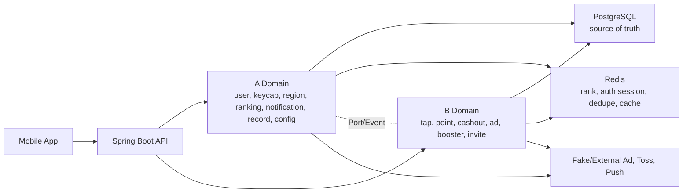

# 꾹머니 아키텍처

## 전체 구조

기술 기준: Java 26, Spring Boot 4.1.0, Jackson 3(`tools.jackson.*`). 저장소 루트 기준, 기준 브랜치 `main`, Windows 환경에서 기본 Gradle `build/` 디렉터리를 사용해 검증한다. 과거 한글 경로용 임시 build/test 우회 설정은 제거했다.

꾹머니는 모듈형 모놀리스로 시작한다. A/B 담당 도메인을 패키지와 Application Port로 분리하고, 서로의 Entity와 Repository를 직접 참조하지 않는다.

## A/B 경계

| 구분 | 도메인 |
|---|---|
| A | 회원/인증, 키캡/상자, 지역/랭킹, 알림, 기록, 설정/법적 문서 |
| B | 탭 검증, 포인트, 출금, 광고/부스터, 친구 초대 |

경계 원칙:

- A는 B 테이블을 직접 조인하지 않는다.
- B는 A Entity/Repository를 직접 사용하지 않는다.
- 사용자 식별자는 `app_user.public_id`를 외부 계약에 사용하고 DB 내부 id는 노출하지 않는다.
- B 이벤트는 A 기록 projection으로 수신한다.
- 광고 완료 자체가 상자를 지급하지 않는다. A는 완료된 `ad_view`를 확인하고 사용자의 기존 상자 1개를 개봉한다.

## 전체 서비스 개념 ERD

```mermaid
erDiagram
    APP_USER ||--o{ AUTH_IDENTITY : has
    DEVICE ||--o{ USER_DEVICE : maps
    APP_USER ||--o{ USER_DEVICE : owns
    APP_USER ||--o{ USER_KEYCAP : owns
    KEYCAP ||--o{ USER_KEYCAP : catalog
    APP_USER ||--|| KEYCAP_BOX_ACCOUNT : has
    APP_USER ||--o{ KEYCAP_BOX_LEDGER : records
    APP_USER ||--o{ KEYCAP_BOX_OPEN : opens
    KEYCAP_BOX_OPEN ||--o{ KEYCAP_BOX_OPEN_RESULT : yields
    REGION ||--o{ USER_REGION : selected
    APP_USER ||--o{ USER_REGION : sets
    RANKING_SEASON ||--o{ RANKING_PARTICIPATION : includes
    RANKING_PARTICIPATION ||--|| RANKING_SCORE : has
    RANKING_SEASON ||--o{ RANKING_SNAPSHOT : settles
    APP_USER ||--o{ RANKING_REWARD : receives
    APP_USER ||--o{ PUSH_DEVICE : registers
    APP_USER ||--o{ NOTIFICATION_LOG : receives
    APP_USER ||--o{ USER_RECORD_DAILY : projects
    APP_USER ||--|| USER_RECORD_SUMMARY : summarizes
    APP_USER ||--o{ AUTH_SESSION_LOG : audits

    TAP_BATCH ||--o{ TAP_EVENT : produces
    APP_USER ||--o| USER_ONBOARDING_PROGRESS : tracks
    TAP_BATCH ||--o{ ABUSE_SIGNAL : flags
    POINT_ACCOUNT ||--o{ POINT_LEDGER : records
    CASHOUT_REQUEST ||--|| TOSS_POINT_TRANSFER : transfers
    AD_PLACEMENT ||--o{ AD_VIEW : serves
    AD_VIEW ||--o| BOOSTER_GRANT : grants
    INVITE_CODE ||--o{ INVITE_RELATION : accepted_by
```

Outbox/Inbox는 `app_user`와 실제 FK를 갖지 않는다. 사용자 정보는 `aggregate_id` 또는 `payload`로 전달한다.

## A 도메인 상세 Aggregate

| Aggregate | 테이블 |
|---|---|
| User/Auth | `app_user`, `auth_identity`, `device`, `user_device`, `auth_session_log` |
| Keycap/Box | `keycap`, `user_keycap`, `keycap_drop_table`, `keycap_drop_item`, `keycap_box_account`, `keycap_box_ledger`, `keycap_box_open`, `keycap_box_open_result` |
| Region | `region`, `user_region`, `user_region_change` |
| Ranking | `ranking_season`, `ranking_participation`, `ranking_score`, `ranking_score_event`, `ranking_snapshot`, `ranking_reward` |
| Notification | `push_device`, `notification_preference`, `notification_log` |
| Record | `user_record_daily`, `user_record_summary`, `user_record_reward` |
| Config/Legal | `app_config`, `legal_document`, `user_consent` |
| Reliability | `event_outbox`, `event_inbox` |

`keycap.code`는 API와 seed/master data가 공유하는 안정 코드다. `keycap.public_id`는 리소스 식별자, `code`는 이름 변경과 무관한 카탈로그 코드로 사용한다.

## B 도메인 상세 Aggregate — PROPOSED

| Aggregate | 테이블 | 경계 원칙 |
|---|---|---|
| Tap/Onboarding/Risk | `tap_batch`, `tap_event`, `user_tap_daily`, `onboarding_settlement`, `abuse_signal` | A에는 검증 결과 delta와 온보딩 정산/보상 지급 요청만 Port/Event로 전달 |
| Point | `point_account`, `point_ledger` | 포인트 원장은 B만 변경 |
| Cashout | `cashout_request`, `toss_point_transfer` | 외부 Toss 지급과 포인트 복원을 B가 소유 |
| Advertisement | `ad_placement`, `ad_view` | A는 완료된 adView 상태만 Port로 조회 |
| Booster | `booster_grant` | 포인트/상자에만 2배, 랭킹 미적용 |
| Invitation | `invite_code`, `invite_relation` | 자격 확정 후 A 상자 지급 Port 호출 |
| Analytics | `analytics_event` | 핵심 트랜잭션과 분리 |

B 테이블은 A Entity/Repository를 참조하지 않고 사용자·기기 public UUID를 scalar로 저장한다. 상세 컬럼은 [table-spec.md](table-spec.md)의 `DRAFT` 명세를 따른다.

## 계약 확정 상태

- A HTTP API와 A 테이블은 `CONFIRMED`다.
- B HTTP API는 구현 가능한 수준으로 선작성한 `PROPOSED`이고, B 테이블은 은창 최종 확정 전까지 `DRAFT`다.
- `PROPOSED` API와 `DRAFT` 테이블은 팀 회의에서 필드·상태·정책 수치를 수정할 수 있으며, 구현 전에 문서 상태를 `CONFIRMED`로 승격한다.

## 설계 이유

### app_user 단일 모델

`app_user`는 Toss 로그인 완료 사용자를 관리한다. MVP에서는 MEMBER만 생성하며, 로그인 전 온보딩 로컬 체험을 위한 임시 서버 사용자나 서버 Session을 만들지 않는다.

### device와 user_device 분리

기기 자체의 식별자와 사용자-기기 관계를 분리한다. 기기 정보는 Toss 로그인 후 회원 인증 Session, Push, 운영 추적에 필요한 범위에서 연결한다. 로그인 전 복구를 위한 기기 소유 관계는 만들지 않는다.

### Redis JWT 인증

Access JWT는 stateless 검증을 유지하되 현재 기기 로그아웃은 jti denylist, 전체 로그아웃·정지·탈퇴는 사용자 revoke 시각으로 차단한다. Refresh JWT는 Rotation이 필요하므로 Redis Refresh Session을 활성 세션 원본으로 둔다. PostgreSQL에는 활성 Refresh Session을 저장하지 않고 `auth_session_log`만 남긴다.

### 상자 보유량과 개봉 조건 분리

상자를 가지고 있는 것과 지금 열 수 있는 조건은 다르다. 보유량은 `keycap_box_account`, 증감은 `keycap_box_ledger`, 개봉 조건은 무료 쿨다운과 광고 완료 검증으로 분리한다.

### 랭킹 Redis + PostgreSQL

최신 랭킹은 지역/전국 구분이 없는 전체 유저 단일 랭킹이다. Redis `rank:overall:{seasonId}` Sorted Set은 빠른 후보 조회에 사용한다. 최종 정렬과 정산은 PostgreSQL의 `ranking_score`, `ranking_score_event`, `ranking_snapshot`을 기준으로 한다. 동점 기준은 `score DESC`, `reached_at ASC`, `user_public_id ASC`다. 회차 종료 시 사용자·시즌별 snapshot을 자동 생성하며, 이전 회차 기록 화면은 이 snapshot을 Source of Truth로 사용한다.

### 온보딩 A/B 경계

앱인토스 온보딩은 로그인 전 프론트 로컬 체험으로 진행한다. 프론트는 최대 45탭과 안정적인 `onboardingAttemptId`를 로컬에 저장하고, 15/30/45 화면은 보상 미리보기와 reveal 연출만 표시한다. 서버 사용자, 인증 Session, 실제 포인트, 키캡, 일반 상자 보상은 Toss 로그인 전 생성하지 않는다.

`POST /api/v1/auth/toss/login`은 Toss auth 정보와 온보딩 정산 후보(`onboardingAttemptId`, `onboardingTapCount`, `onboardingCompleted`)를 함께 받을 수 있다. 서버는 `submittedTapCount`를 0..45로 clamp하고, `acceptedTapCount = min(submittedTapCount, 45, KST 당일 남은 유효 탭 한도)`만 B의 `user_tap_daily`, 랭킹, 일반 탭 수학에 반영한다. 부스터는 로그인 전 탭에 소급 적용하지 않는다.

신규 가입자에게만 `ONBOARDING_15_TAP_POINT`, `ONBOARDING_30_TAP_POINT` 포인트 원장으로 총 2P와 고정 온보딩 키캡 1개를 한 번 지급한다. 기존 회원에게는 온보딩 포인트와 키캡 보상을 지급하지 않고 인정 가능한 탭만 반영한다. `onboardingAttemptId` 정산 결과는 재시도 멱등성을 위해 저장하며, 같은 사용자와 KST 일자 기준 로그인 전 온보딩 정산은 한 번만 실제 탭에 반영한다.

### 기록 Projection

기록 화면은 A/B 운영 테이블을 직접 조인하지 않는다. A 내부 이벤트와 B 이벤트를 `event_inbox`로 수신해 `user_record_daily`, `user_record_summary`, `user_record_reward`에 투영한다.

## Toss 로그인과 온보딩 정산

### 로그인 전 로컬 온보딩

1. 앱 시작 시 서버 API를 호출해 임시 서버 사용자나 인증 Session을 만들지 않는다.
2. 프론트는 `onboardingAttemptId`, 탭 수, 완료 여부를 로컬에 저장한다.
3. 15/30/45 보상 화면은 서버 지급 완료가 아니라 신규 가입 보상 미리보기와 애니메이션으로 처리한다.

### Toss 신규 회원 로그인

1. Toss identity로 기존 `auth_identity`가 없으면 MEMBER `app_user`를 생성한다.
2. 필요 시 `device`, `user_device`를 로그인 완료 회원 기기로 연결한다.
3. Redis auth Session과 token pair를 생성한다.
4. 온보딩 정산 입력이 있으면 `onboarding_settlement`를 생성 또는 조회한다.
5. `acceptedTapCount`만 B 탭/랭킹 반영 Port로 전달한다.
6. 신규 가입 보상으로 총 2P와 고정 온보딩 키캡을 멱등 지급한다.
7. `auth_session_log`, `PreloginOnboardingSettled`, `OnboardingPointRewardGranted`, `OnboardingKeycapGranted` 이벤트를 남긴다.

### Toss 기존 회원 로그인

1. Toss identity로 기존 MEMBER를 찾는다.
2. 필요 시 `device`, `user_device`를 로그인 완료 회원 기기로 연결한다.
3. Redis auth Session과 token pair를 생성한다.
4. 온보딩 정산 입력이 있으면 `onboarding_settlement`를 생성 또는 조회한다.
5. `acceptedTapCount`만 B 탭/랭킹 반영 Port로 전달한다.
6. 기존 회원에게는 온보딩 포인트와 키캡 보상을 지급하지 않는다.

### 복구와 재시도

`onboardingAttemptId` 기준으로 정산 결과를 저장해 응답 유실, 앱 재실행, 부분 실패 후 재시도에서도 신규/기존 회원 판정과 보상 지급 여부를 유지한다. 로그인과 A/B 보상 정산의 트랜잭션 경계, 회원 생성 후 부분 실패 복구 방식은 Decision Required다.

## A/B Port와 Event

| 방향 | 계약 | 설명 |
|---|---|---|
| B -> A | `ValidatedTapApplyUseCase` | 검증 완료 탭을 A 상자 진행도와 랭킹 점수에 반영 |
| B -> A | `KeycapBoxGrantUseCase` | 친구초대 등 B 도메인 사유로 A 상자 보유량 지급 |
| B -> A | `OnboardingKeycapGrantUseCase` | 로그인 정산 중 신규 가입자에게 고정 온보딩 키캡 1개를 멱등 지급하고 결과 반환 |
| B -> A | `RecordEventIngestUseCase` | 포인트/출금/광고 등 B 이벤트를 A 기록 조회 모델에 투영 |
| A -> B | `AdvertisementVerificationPort` | 광고 상자 개봉 전에 B의 완료된 `ad_view` 상태를 로컬 조회 |
| A -> B | `UserWithdrawalGuardPort` | 회원 탈퇴 전에 B 처리 중 출금 등 차단 사유 조회 |

공통 이벤트 필드는 `eventId`, `eventType`, `userId`, `referenceId`, `occurredAt`, `payload`다.

## 빵도감 인증 재사용 전략

분석 대상은 `Bean-zip-Team/bread-diary-backend` `main` 브랜치 HEAD `e9a6abb73320e61869f91b14293e5da3d1fbe4f2`다. 원격에서 `develop` 브랜치는 확인되지 않았다. 로컬 빵도감 저장소 경로와 운영 로그 경로는 제공되지 않아 확인하지 못했다.

현재 꾹머니 구현 상태:

- `AccessLogFilter`, `RequestLogContext`, `ApiResponse`, `ApiError`, `ApiErrorResponse`, `GlobalExceptionHandler`: `IMPLEMENTED`
- `JwtTokenProvider`: 기본 secret 없음, blank/짧은 secret/과거 로컬 기본 문자열 거절 기준 `IMPLEMENTED`
- `AuthController`, `AuthInterceptor`, 인증 DTO: `/api/v1` 실제 경로 기준 `IMPLEMENTED`
- `AuthSession` Redis 모델, `RedisAuthSessionRepository`, Redis Lua CAS, Access Token denylist, 사용자 revoke timestamp, Lua 원자 logout-all: `RedisAuthSessionRepositoryIntegrationTest`, `RefreshLuaCasIntegrationTest`, `AuthServiceLogoutAllIntegrationTest`, `AuthApiIntegrationTest` 기준 `IMPLEMENTED`
- `auth_session_log` Entity/Repository, JSONB/UUID/enum 저장, 최소 Flyway SQL 적용: `FlywayMigrationIntegrationTest`, `AuthAuditServiceIntegrationTest` 기준 `IMPLEMENTED`
- 감사 로그 저장 실패 Outbox/재처리와 운영 장애 복구 전체 정책: `IN_PROGRESS`
- Toss 로그인/회원 생성과 온보딩 로그인 정산: `NOT_STARTED`

| 빵도감 파일 또는 클래스 | 현재 역할 | 의존 도메인 | 꾹머니 대응 | 재사용 등급 | 변경 사항 | 주의 | 관련 테스트 |
|---|---|---|---|---|---|---|---|
| `JwtTokenProvider` | HS256 JWT 생성/파싱/검증, `sub`, `sid`, `type`, `jti`, `iat`, `exp` 처리 | UserSession UUID | JWT Provider | 2 | issuer, token type 값 `ACCESS/REFRESH`, user public id, `issuedAtMillis` 사용 | secret 하드코딩 금지, exp 검증 유지 | `JwtTokenProviderTest` |
| `AuthService.refresh` | Refresh JWT 검증, hash 비교, jti 비교, token rotation | JPA UserSession | Redis Refresh Rotation Service | 2 | `findSessionForUpdate`를 Lua CAS + `auth:refresh:{sessionId}`로 변경 | 동시 충돌과 실제 재사용을 구분 | `AuthServiceTest`, `AuthServiceConcurrencyTest` |
| `UserSessionService` | 세션 생성/조회/회전/폐기 | JPA Repository | Redis Session Adapter | 2 | JPA 저장소 제거, Redis TTL/Sorted Set 관리로 변경 | Redis가 Source of Truth | `UserSessionServiceTest` |
| `UserSession` | refresh hash, current jti, expires, revoked 관리 | JPA Entity | Redis Session JSON/Hash DTO | 2 | Entity로 복사하지 않고 값 객체로 축소 | PostgreSQL 활성 세션 테이블 금지 | `AuthRefreshMysqlIntegrationTest`는 Redis 통합 테스트로 대체 |
| `UserSessionRepository` | Pessimistic row lock | MySQL/JPA | Redis Lua CAS | 3 | 직접 재사용하지 않음 | 일반 Redis 명령 조합 대안을 쓰는 경우에만 lock 필요 | `AuthRefreshMysqlIntegrationTest` 참고 |
| `AuthController` | Toss login, refresh, logout API | Bread auth path | 꾹머니 인증 API | 2 | `/api/v1/auth/toss/login`, `/api/v1/auth/refresh`, `/api/v1/auth/logout`, `/api/v1/auth/logout-all`로 변경 | `/api/v1/auth/toss/login`은 device 계약 미확정으로 `TOSS_DEVICE_CONTRACT_REQUIRED` Blocking 처리 | `AuthApiIntegrationTest` |
| `AuthInterceptor` | Access JWT 검증, 세션 조회, request attribute 설정 | JPA UserSession | Authentication Filter/Interceptor | 2 | Redis denylist와 Redis session 조회 정책 추가 | 고위험 API는 Redis 장애 fail-closed | `AuthInterceptorTest` |
| `AccessLogFilter` | request trace, access log, IP, userId/sessionId 기록 | Global web | 공통 Access Log Filter | 1 | `traceId` 명칭으로 통일 | query/header/token 미기록 유지 | `AccessLogFilterTest` |
| `RequestLogContext` | 요청 추적 id 조회 | Global logging | 공통 trace context | 1 | `traceId` 명칭으로 통일 | 응답 wrapper의 `traceId`와 동일 값 사용 | `AccessLogFilterTest` |
| `RateLimitInterceptor` | `/api/v1/auth/refresh` rate limit 로그 | Global rate limit | 인증 rate limit 후보 | 2 | Redis 기반 rate limit로 변경 가능 | refresh brute-force 방어 | `RateLimitInterceptorTest` |
| Toss 회원 생성/동기화 로직 | 빵도감 User 생성/복구 | Bread User | Toss Adapter/Fake Adapter | 3 | 직접 복사하지 않음 | 앱인토스 auth 계약과 온보딩 정산 경계 확정 필요 | `AuthServiceTest` 일부 참고 |
| Redis Session Repository | 빵도감 main HEAD에서 미발견 | 없음 | 새로 추가 | 4 | `auth:refresh`, `auth:user-sessions`, denylist 설계 필요 | Redis 장애 정책 필수 | 꾹머니 신규 테스트 |
| Access denylist | 빵도감 main HEAD에서 미발견 | 없음 | 새로 추가 | 4 | `auth:deny:access:{jti}` | logout/정지/탈퇴 즉시 차단 | 꾹머니 신규 테스트 |
| 인증 감사 테이블 | 빵도감 main HEAD에서 미발견 | 없음 | `auth_session_log` | 4 | 영구 감사 로그 설계 | 토큰 원문 저장 금지 | 꾹머니 신규 테스트 |

재사용 등급: 1 그대로 재사용 가능, 2 패키지명·도메인 타입 변경 후 재사용 가능, 3 빵도감 전용이라 재사용 불가, 4 꾹머니에서 새로 추가해야 함.

## 로그 전략

로그는 네 종류로 구분한다.

| 분류 | 저장 위치 | 목적 |
|---|---|---|
| Access Log | 애플리케이션 로그 | 모든 HTTP 요청 추적 |
| Auth Audit Log | `auth_session_log` | 로그인, refresh, 로그아웃, 거부 이력 감사 |
| Domain Ledger | 포인트/상자/보상 원장 | 금액성/보상성 상태 변화 재처리와 감사 |
| Error/Infrastructure Log | 애플리케이션 로그와 운영 알림 | Redis, DB, Toss, 광고, Outbox 장애 진단 |

Access Log 필드:

- `traceId`
- `method`
- `pathTemplate`
- `status`
- `durationMs`
- `userPublicId`
- `sessionIdHash` 또는 일부 마스킹값
- `devicePublicId`
- `clientIpMasked`
- `userAgent`
- `errorCode`

요청 추적 id 명칭은 `traceId`로 통일한다. 응답 wrapper의 `traceId`와 Access Log의 `traceId`는 같은 값이다.

Auth Audit Log는 [table-spec.md](table-spec.md)의 `auth_session_log`를 기준으로 한다. Redis 인증 상태 변경이 성공한 뒤 `auth_session_log` 저장이 실패해도 성공한 인증 상태를 원복하지 않는다. 감사 로그 저장 실패는 Error/Infrastructure Log에 남기고 재처리 대상으로 둔다.

로그 금지 대상:

- Authorization header
- Access Token
- Refresh Token
- Toss authorizationCode
- Push Token
- presigned URL query
- Request Body 전체
- 민감한 Query String

## 2026-07-03 인증/로그 구현 검증 반영

- `FullStackIntegrationTestSupport`에 `@DirtiesContext(classMode = DirtiesContext.ClassMode.AFTER_CLASS)`를 적용했다. 통합 테스트 클래스 종료 후 Spring Context를 폐기해 종료된 Redis/PostgreSQL Testcontainer 포트가 다음 클래스에 재사용되는 문제를 방지한다.
- Redis Refresh Rotation은 Lua CAS 방식으로 유지한다. 별도 Redis refresh lock key는 사용하지 않는다.
- 거의 동시 Refresh 충돌은 `AUTH_REFRESH_CONFLICT`로 처리하고 Session을 폐기하지 않는다. Rotation 완료 후 과거 Refresh Token 재사용은 `AUTH_REFRESH_REUSED`로 처리하고 Session을 폐기하며 `REFRESH_REUSE_DETECTED` 감사 로그를 남긴다.
- logout-all Lua 내부 처리는 만료 Session 정리, 활성 Refresh Session 삭제, user session ZSet 삭제, 사용자 revoke marker 저장, 현재 access denylist 저장까지 `IMPLEMENTED`다. 다만 `RedisAuthSessionRepository.save(AuthSession)`이 refresh hash 저장, TTL 설정, user-sessions ZSet 추가를 분리 실행하므로 Session save와 logout-all 사이 race 방지는 `IN_PROGRESS`다.
- Toss 로그인/회원 인증 Session 운영 전 Session save를 단일 Redis Lua Script로 만들고, `issuedAtMillis <= revokedAtMillis`인 세션 생성을 거절해야 한다. 같은 보강에서 Refresh Rotation도 사용자 revoke marker를 확인하고 revoked session이면 refresh hash/ZSet을 정리한 뒤 `AUTH_USER_REVOKED`를 반환한다.
- Redis Cluster 전환 시 관련 Lua key는 같은 hash slot에 있어야 하며, `{userPublicId}` hash tag 기반 key 설계는 후속 결정 사항이다.
- `AuthAuditService`는 감사 로그 저장 실패가 Redis 인증 상태 변경을 rollback하지 않도록 인증 상태 변경 경계 밖에서 실패를 삼키고 Error/Infrastructure Log를 남긴다.
