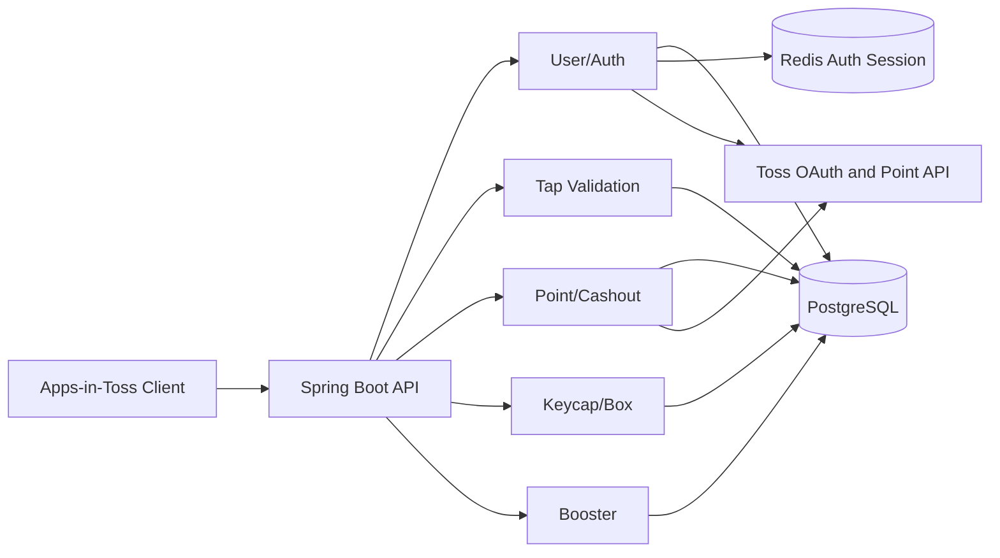
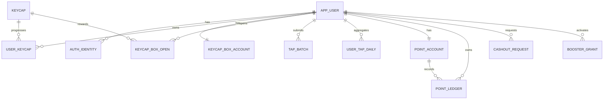

# 꾹머니 13개 테이블 MVP 아키텍처

## 구조 원칙

꾹머니는 하나의 Spring Boot 애플리케이션과 하나의 PostgreSQL을 사용하는 모듈형 모놀리스로 시작한다.

- PostgreSQL은 사용자, 포인트, 상자, 키캡, 탭, 출금 상태의 Source of Truth다.
- Redis는 꾹머니 Refresh Session, 사용자별 Session 목록, Access denylist, 사용자 revoke 시각에 사용한다.
- `app_user.id`는 UUID PK이며 API, JWT, Redis, FK에서 같은 값을 사용한다.
- 핵심 잔액 변경은 동일 PostgreSQL 트랜잭션 안에서 처리한다.
- 이번 13개 테이블 범위에서는 Event Inbox와 Event Outbox를 사용하지 않는다.
- 외부 Toss 포인트 지급 결과는 `cashout_request`에 함께 저장한다.
- 개별 탭은 저장하지 않고 `tap_batch`와 `user_tap_daily`에 집계한다.
- Toss OAuth Token은 로그인과 탈퇴 요청 처리 중에만 사용하고 PostgreSQL과 Redis에 장기 저장하지 않는다.

## 식별자 전략

### 사용자

```text
app_user.id: UUID PK
JWT sub: app_user.id 문자열
Redis auth:user-sessions:{userId}: 같은 UUID 문자열
모든 user_id FK: UUID
```

사용자에는 별도 `public_id`를 두지 않는다. `id` 자체가 추측하기 어려운 UUID이며 빵도감의 사용자 식별자 전략과 일치한다.

### 나머지 리소스

- 업무 테이블은 기본적으로 `BIGINT` 내부 PK를 유지한다.
- API에서 직접 노출되는 리소스는 `public_id UUID` 또는 `code`를 사용한다.
- API에 BIGINT PK를 노출하지 않는다.

## 도메인 구성



## 13개 테이블 ERD



`app_config`는 FK를 연결하지 않는 운영 정책 저장소다.

## Toss 로그인과 온보딩

### 현재 구현 흐름

1. 프론트가 Toss `appLogin()`으로 `authorizationCode`, `referrer`를 얻는다.
2. 서버가 mTLS로 Toss `generate-token`을 호출한다.
3. 발급된 Toss Access Token으로 `login-me`를 호출한다.
4. `login-me.userKey`를 문자열로 변환해 `auth_identity(provider=TOSS, provider_user_id)`를 조회한다.
5. 기존 Identity가 연결된 `app_user.status=WITHDRAWN`이면 자동 재가입하지 않고 `ACCOUNT_WITHDRAWN`을 반환한다.
6. 신규 사용자면 UUID `app_user`, `auth_identity`, `point_account`, `keycap_box_account`, `user_tap_progress`를 생성한다.
7. 꾹머니 Access/Refresh JWT를 생성하고 Redis Session을 저장한다.
8. Toss Access/Refresh Token은 저장하지 않는다.

현재 구현에서는 Redis Session 저장이 `@Transactional` 로그인 메서드 안에서 수행된다. Redis 저장 실패 시 로그인 성공으로 응답하지 않지만, DB 커밋 이후 저장하는 구조는 아니다. 이미 생성된 DB 사용자와 Identity는 Unique 제약으로 보호되므로 재시도 시 중복 생성을 막는다.

### 목표 온보딩 계약 · 정합화 필요

> 정합화 필요: 현재 `TossLoginRequest`에는 온보딩 정산 필드가 없다. 로그인 DTO에 온보딩 정보를 포함할지, 별도 온보딩 정산 API로 분리할지 결정하기 전까지 아래 온보딩 흐름은 목표 계약으로만 취급한다.

로그인 요청에 온보딩 정산 정보를 포함하는 방식이 확정될 경우 다음 처리를 같은 PostgreSQL 트랜잭션에서 수행한다.

- 온보딩 45탭 검증
- 신규 사용자 포인트 지급
- 신규 사용자 고정 키캡 지급
- `onboardingAttemptId` 기반 멱등 처리

## Refresh와 로그아웃

- Refresh는 Redis Session의 현재 Refresh JTI와 hash를 검증하고 Lua CAS로 Rotation한다.
- 현재 Session 로그아웃은 `sid` Session 삭제 또는 revoke, 현재 Access `jti` denylist를 수행한다.
- 로그아웃 요청에 Refresh Token이 전달되면 동일 Session Token인지 추가 검증한다.
- logout-all은 사용자 UUID 기준 활성 Session을 전부 폐기하고 사용자 revoke 시각을 갱신한다.
- 로그아웃은 Toss 연결과 `auth_identity`를 변경하지 않는다.

## 회원 탈퇴

1. 인증된 사용자가 `POST /api/v1/members/me/withdrawal`을 호출한다.
2. Request Body의 새 Toss `authorizationCode`, `referrer`를 `generate-token`과 `login-me`로 검증한다.
3. 응답 `userKey`가 현재 사용자의 `auth_identity.provider_user_id`와 같아야 한다.
4. 같은 Toss Access Token으로 `remove-by-user-key`를 호출한다.
5. 외부 연결 해제가 성공하면 로컬 트랜잭션에서 `app_user.status=WITHDRAWN`, `withdrawn_at` 설정, 닉네임과 프로필 이미지 익명화를 수행한다.
6. 포인트 원장, 출금 이력, 상자 개봉 이력은 삭제하지 않는다.
7. Redis의 모든 Session과 Access Token을 즉시 폐기한다.

현재 구현은 `@Transactional` 탈퇴 메서드 안에서 Toss unlink 외부 호출 뒤 로컬 탈퇴와 Redis Session 폐기를 수행한다. 외부 Toss 연결 해제 성공 뒤 로컬 처리에 실패할 수 있으므로 Toss unlink Webhook은 같은 탈퇴 처리를 멱등하게 재실행하는 보완 흐름이다.

## 탭 배치

한 번의 탭 배치 반영은 아래 데이터를 하나의 트랜잭션으로 처리한다.

```text
tap_batch
+ user_tap_daily
+ user_tap_progress
+ point_account
+ point_ledger
+ keycap_box_account
```

- `(user_id, tap_session_id, sequence)`로 중복을 차단한다.
- `request_hash`가 다르면 동일 순번 재사용으로 판단한다.
- 유효 탭만 포인트와 상자 진행도에 반영한다.
- 상자 진행도는 `user_tap_progress.cumulative_valid_tap_count`와 `user_tap_progress.next_box_target`을 원본으로 사용하고, 목표 도달 시 `keycap_box_account.box_balance`만 증가시킨다.
- 개별 탭 간격 원문은 기본 저장하지 않고 `interval_stats` JSONB에 통계만 저장한다.

## 상자 개봉과 키캡 조각

상자 개봉 API는 후속 구현 대상이다. 최종 트랜잭션 계약은 아래 순서다.

1. `Idempotency-Key`를 검증하고 `openMethod`, `adRewardId` 기반 `request_hash`를 계산한다.
2. `(user_id, idempotency_key)` 기존 개봉 이력이 있으면 `request_hash`를 비교한다. 같으면 기존 결과를 반환하고, 다르면 `IDEMPOTENCY_KEY_REUSED`를 반환한다.
3. `keycap_box_account`를 잠근다.
4. 모든 개봉은 `box_balance`를 1 차감한다. `FREE`는 추가로 `free_open_ticket_count`를 1 차감한다. `ADVERTISEMENT`는 검증된 `ad_reward_id`를 소비하며, 광고 검증 Service가 구현되기 전에는 미지원 오류로 처리하고 자원을 차감하지 않는다.
5. 서버가 활성 키캡 후보에서 대상 키캡과 지급 조각 수를 결정한다. MVP 기본 지급 조각 수는 1개다.
6. `user_keycap`이 없으면 생성하고, 있으면 `shard_count`를 증가시킨다. 조각 수는 `required_shard_count`를 초과 저장하지 않는다.
7. 필요 조각 수 이상이면 `status=COMPLETED`, `completed_at`을 설정한다.
8. `keycap_box_open`에 개봉 방식, 멱등키, 요청 해시, 보상 결과를 한 행으로 저장한다.

현재 부스터는 포인트 적립 전용이므로 상자 개봉 조각 수에 적용하지 않는다.

## 포인트 출금

1. `point_account`를 잠근다.
2. 출금 가능한 잔액과 최소 단위를 확인한다.
3. `point_ledger`에 차감 원장을 추가한다.
4. `cashout_request`를 `PENDING` 또는 `PROCESSING`으로 생성한다.
5. 외부 Toss 지급 성공 시 `SUCCEEDED`, 실패 시 `FAILED`로 전환한다.
6. 복구 가능한 실패면 `CASHOUT_REFUND` 원장으로 포인트를 되돌린다.

## 후속 확장 원칙

랭킹, 알림, 기록, 원장 세분화, Outbox는 실제 요구가 확정될 때 별도 Migration으로 추가한다. 이전 확장 설계의 테이블을 한 번에 복구하지 않는다.

## 코드 검토 필요 항목

- 로그인에서 JWT 생성과 Redis Session 저장은 DB 커밋 이전에 수행된다. Redis Session 저장 이후 응답 생성 또는 트랜잭션 커밋 실패 시 정리 전략을 확인해야 한다.
- logout-all은 사용자 revoke marker를 저장하지만 현재 Session 저장 경로가 marker를 확인하지 않는다. logout-all과 신규 로그인 Session 저장 경쟁 차단은 아직 보장되지 않는다.
- 사용자 요청 탈퇴와 Toss unlink Webhook이 동시에 처리될 때 상태 변경, 개인정보 익명화, Redis Session 폐기가 멱등하게 수렴하는지 동시성 검증이 필요하다.
- 출금, 탭, 상자, 부스터는 Persistence schema가 있으나 Controller/Service 트랜잭션 구현은 아직 없으므로 위 처리 흐름은 목표 계약이다.
