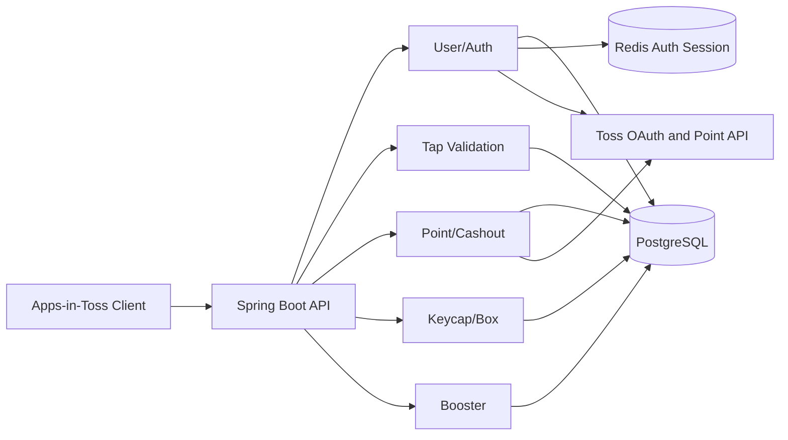
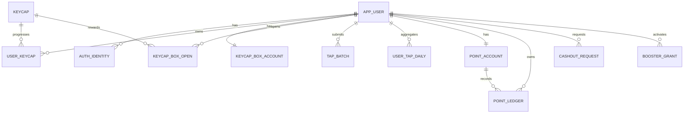

# 꾹머니 13개 테이블 MVP 아키텍처

## 구조 원칙

꾹머니는 하나의 Spring Boot 애플리케이션과 하나의 PostgreSQL을 사용하는 모듈형 모놀리스로 시작한다.

- PostgreSQL은 사용자, 포인트, 상자, 키캡, 탭, 출금 상태의 Source of Truth다.
- Redis는 꾹머니 Refresh Session, 사용자별 Session 목록, Access denylist, 사용자 revoke 시각에 사용한다.
- `app_user.id`는 UUID PK이며 API, JWT, Redis, FK에서 같은 값을 사용한다.
- 핵심 잔액 변경은 동일 PostgreSQL 트랜잭션 안에서 처리한다.
- 이번 13개 테이블 범위에서는 Event Inbox와 Event Outbox를 사용하지 않는다.
- 외부 Toss 포인트 지급 결과는 `cashout_request`에 함께 저장한다.
- 개별 탭은 저장하지 않고 `tap_batch`와 `user_tap_daily`에 집계한다.
- Toss OAuth Token은 로그인과 탈퇴 요청 처리 중에만 사용하고 PostgreSQL과 Redis에 장기 저장하지 않는다.

## 식별자 전략

### 사용자

```text
app_user.id: UUID PK
JWT sub: app_user.id 문자열
Redis auth:user-sessions:{userId}: 같은 UUID 문자열
모든 user_id FK: UUID
```

사용자에는 별도 `public_id`를 두지 않는다. `id` 자체가 추측하기 어려운 UUID이며 빵도감의 사용자 식별자 전략과 일치한다.

### 나머지 리소스

- 업무 테이블은 기본적으로 `BIGINT` 내부 PK를 유지한다.
- API에서 직접 노출되는 리소스는 `public_id UUID` 또는 `code`를 사용한다.
- API에 BIGINT PK를 노출하지 않는다.

## 도메인 구성



## 13개 테이블 ERD



`app_config`는 FK를 연결하지 않는 운영 정책 저장소다.

## Toss 로그인과 온보딩

1. 프론트가 Toss `appLogin()`으로 `authorizationCode`, `referrer`를 얻는다.
2. 서버가 mTLS로 Toss `generate-token`을 호출한다.
3. 발급된 Toss Access Token으로 `login-me`를 호출한다.
4. `login-me.userKey`를 문자열로 변환해 `auth_identity(provider=TOSS, provider_user_id)`를 조회한다.
5. 기존 Identity가 연결된 `app_user.status=WITHDRAWN`이면 자동 재가입하지 않고 `ACCOUNT_WITHDRAWN`을 반환한다.
6. 신규 사용자면 UUID `app_user`, `auth_identity`, `point_account`, `keycap_box_account`를 생성한다.
7. 유효한 온보딩 45탭 입력이면 포인트 원장과 고정 키캡을 같은 PostgreSQL 트랜잭션에서 지급한다.
8. DB 커밋 뒤 Redis Session을 생성하고 꾹머니 Access/Refresh JWT를 발급한다.
9. Toss Access/Refresh Token은 저장하지 않는다.

Redis Session 저장에 실패하면 로그인 성공으로 응답하지 않는다. 이미 생성된 DB 사용자와 보상은 멱등 키로 보호되므로 재시도 시 중복 생성하거나 중복 지급하지 않는다.

## Refresh와 로그아웃

- Refresh는 Redis Session의 현재 Refresh JTI와 hash를 검증하고 Lua CAS로 Rotation한다.
- 현재 Session 로그아웃은 `sid` Session 삭제 또는 revoke, 현재 Access `jti` denylist를 수행한다.
- 로그아웃 요청에 Refresh Token이 전달되면 동일 Session Token인지 추가 검증한다.
- logout-all은 사용자 UUID 기준 활성 Session을 전부 폐기하고 사용자 revoke 시각을 갱신한다.
- 로그아웃은 Toss 연결과 `auth_identity`를 변경하지 않는다.

## 회원 탈퇴

1. 인증된 사용자가 `POST /api/v1/members/me/withdrawal`을 호출한다.
2. Request Body의 새 Toss `authorizationCode`, `referrer`를 `generate-token`과 `login-me`로 검증한다.
3. 응답 `userKey`가 현재 사용자의 `auth_identity.provider_user_id`와 같아야 한다.
4. 같은 Toss Access Token으로 `remove-by-user-key`를 호출한다.
5. 외부 연결 해제가 성공하면 로컬 트랜잭션에서 `app_user.status=WITHDRAWN`, `withdrawn_at` 설정, 닉네임과 프로필 이미지 익명화를 수행한다.
6. 포인트 원장, 출금 이력, 상자 개봉 이력은 삭제하지 않는다.
7. Redis의 모든 Session과 Access Token을 즉시 폐기한다.

외부 Toss 연결 해제 성공 뒤 로컬 처리에 실패할 수 있으므로 Toss unlink Webhook은 같은 탈퇴 처리를 멱등하게 재실행한다.

## 탭 배치

한 번의 탭 배치 반영은 아래 데이터를 하나의 트랜잭션으로 처리한다.

```text
tap_batch
+ user_tap_daily
+ point_account
+ point_ledger
+ keycap_box_account
```

- `(user_id, tap_session_id, sequence)`로 중복을 차단한다.
- `request_hash`가 다르면 동일 순번 재사용으로 판단한다.
- 유효 탭만 포인트와 상자 진행도에 반영한다.
- 개별 탭 간격 원문은 기본 저장하지 않고 `interval_stats` JSONB에 통계만 저장한다.

## 상자 개봉과 키캡 조각

1. `keycap_box_account`를 잠근다.
2. 무료 개봉 또는 검증된 광고 보상 여부를 확인한다.
3. 서버가 대상 키캡과 조각 수를 결정한다.
4. `user_keycap.shard_count`를 증가시킨다.
5. 필요 조각 수 이상이면 `status=COMPLETED`, `completed_at`을 설정한다.
6. `keycap_box_open`에 개봉 방식과 결과를 한 행으로 저장한다.

## 포인트 출금

1. `point_account`를 잠근다.
2. 출금 가능한 잔액과 최소 단위를 확인한다.
3. `point_ledger`에 차감 원장을 추가한다.
4. `cashout_request`를 `PENDING` 또는 `PROCESSING`으로 생성한다.
5. 외부 Toss 지급 성공 시 `SUCCEEDED`, 실패 시 `FAILED`로 전환한다.
6. 복구 가능한 실패면 `CASHOUT_REFUND` 원장으로 포인트를 되돌린다.

## 후속 확장 원칙

랭킹, 알림, 기록, 원장 세분화, Outbox는 실제 요구가 확정될 때 별도 Migration으로 추가한다. 이전 확장 설계의 테이블을 한 번에 복구하지 않는다.
